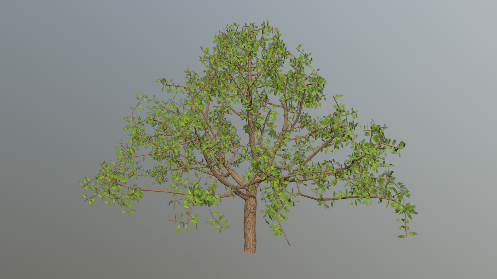
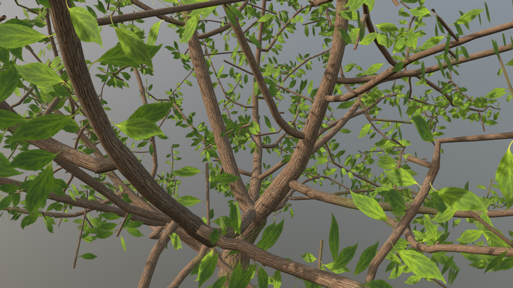
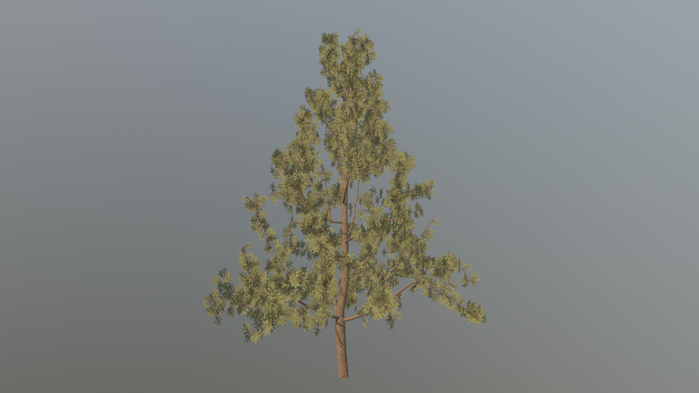
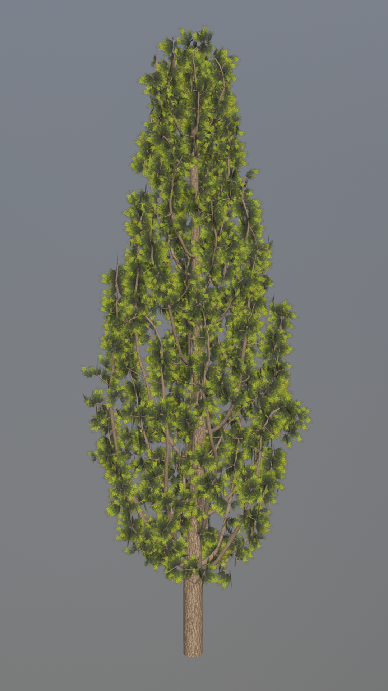

# Generating Trees with a Space Colonization Algorithm

A parallel C++ tool to procedurally generate trees using a space colonization
algorithm.

The project is based on the [Yocto/GL](https://github.com/xelatihy/yocto-gl) and
the [Voro++](http://math.lbl.gov/voro++/) libraries.
The algorithm used is taken from the paper "Modeling Trees with a Space
Colonization Algorithm" by Runions, Lane and Prusinkiewicz; while the method to
evaluate the parallel transport frame is taken from "Parallel Transport Approach
to Curve Framing" by Hanson and Ma.

The texture we have used to generate the models are all taken from the website
[textures.com](https://textures.com).

## Implementation

The basic input for the tool is the shape of the tree's crown and a number of
attraction points, which will be randomly placed in the crown. After this, the
growth begins and the tool uses the **Voro++** library to compute two Voronoi
Diagrams, one for the attraction points and the other for the tree nodes. We
then loop on the nodes (for each one we create a new thread), we search for
the closest attraction point within a certain distance called *radius of
influence* for each tree node (we use the attraction points' loop to search for
this) and compute the *growth* by adding a new node which will be closer to the
attraction point. Once a tree node is within the *kill distance* of an
attraction point, the point is considered dead and will not influence the growth
in future iterations.

The growth loop continues as long as:
 - there is at least one attraction point which is **not** dead
 - the max number of iterations (which is an optional input parameter) has not
   been reached yet

Once the growth has ended, the model is created; in order to create this, we
associate each node to a certain radius (for leaves, i.e. the nodes which are
childless, we use a constant value) which is calculated as the e-th root of
the sum of the children's radius elevated to the e (where e = 2.05): the radius
is then used to create the cylinder which connects the node to its father.
The cylinder's direction is based off of the father's parallel transport frame.

## Parameters

The following parameters can be used as inputs:
- `-N int` to specify the number of attraction points to be randomly placed
- `-D float` to specify the distance between a *father* node and one of its
 *children* nodes
- `-di float` to specify the radius of influence
- `-dk float` to specify the kill distance
- `-i int` to specify the max number of iterations
- `-l path` to specify the leaves/flowers texture to use in the generation
- `-o path` to specify the output directory
- the crown shape can be chosen from the following options:
    - `CONE`: specifying the crown's height
    - `DOME`: specifying the crown's radius
    - `CYLINDER`: specifying the crown's height and the radius
    - `BEZIER`: specifying the four points which define the spline
- the trunk's height, i.e. the distance between the root and the crown

It is possible to display an help message using the `-h` parameter.

## Examples

#### Simple Tree





```bash
bin/tree-gen -N 800 DOME 2 6
```

#### Fir



```bash
bin/tree-gen -di 50 -l resources/needle_leaf.png CONE 2 10 5
```

#### Cypress



```bash
bin/tree-gen -N 1000  -di 50 -l resources/small_branch.png BEZIER 2 0 1 2 4.5 7 0.5 12 1
```

## Authors

[Manuel Prandini](https://github.com/ManuelPrandini)

[Davide Sforza](https://github.com/dsforza96)

[Giovanni Varricchione](https://github.com/giovannivarr)
